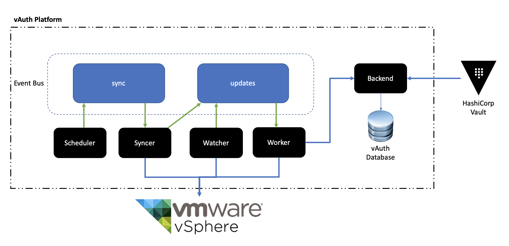

# vauth

[][travis]
[![GoReportCard][report-badge]][report]
[](https://github.com/martezr/vauth/releases/)
[](https://github.com/martezr/vauth/blob/master/LICENSE)

[travis]: https://travis-ci.org/martezr/vauth

[report-badge]: https://goreportcard.com/badge/github.com/martezr/vauth
[report]: https://goreportcard.com/report/github.com/martezr/vauth

VMware vSphere VM Identity Platform

The vAuth Identity platform works in conjunction with the [vSphere Vault Auth Plugin](https://github.com/martezr/vault-plugin-auth-vsphere).

# vAuth Architecture



|Component|Description|
|---------|-----------|
| Scheduler| Schedule the synchronization process |
| Syncer   | Synchronize VMs without identity data|
| Watcher | Watch for relevant VMware vSphere events such as power on operations |
| Worker | Generate the identity data (VM Name, Datacenter, VM Folder and Secret Key) and add that to the VM attributes|
| Backend | REST API for Vault auth validation and Database interaction |
| NATS | Event bus for system transactions |
| DB | Cockroachdb for persistent VM identity data presented by the backend in response to Vault auth validation requests |

## Libraries

The following third party libraries have been used to build the vAuth platform.

|Name|Description|
|----|-----------|
|govmomi||
|nats-io||
|jasonlvhit/gocron||

## Account Permissions

Read

The watcher service connects to the vSphere event manager to "watch" for power on events in order to ensure that virtual machines receive identity data when they are powered on.

Virtual Machine > Change Configuration > Advanced Configuration

## Setup

The scheduler service runs a sync function on a schedule that pushes a message to the event bus that triggers the worker service to iterate through vCenter and assign identity data to virtual machines.

The interval at which the scheduler runs can be configured using the sync_interval environment variable.


```
docker-compose up -d
```